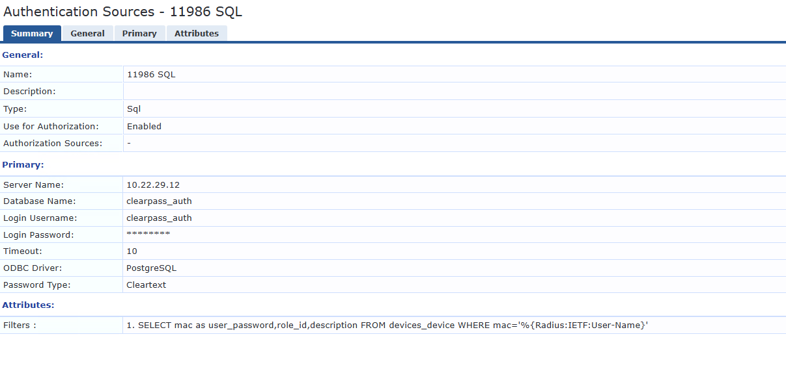
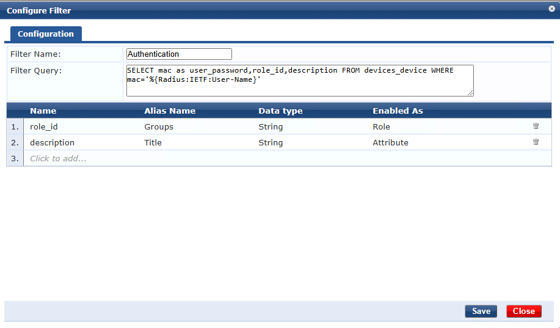

# clearpass-device-db

A database to manage MAC addresses for MAC-authentication with Aruba ClearPass

Add authentication source:

Configure Authentication Source with this filter query:
`SELECT mac as user_password,role_id,description FROM devices_device WHERE mac='%{Radius:IETF:User-Name}'`

Set attributes as shown:
